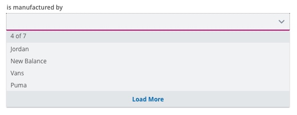
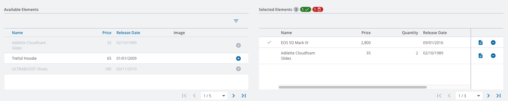
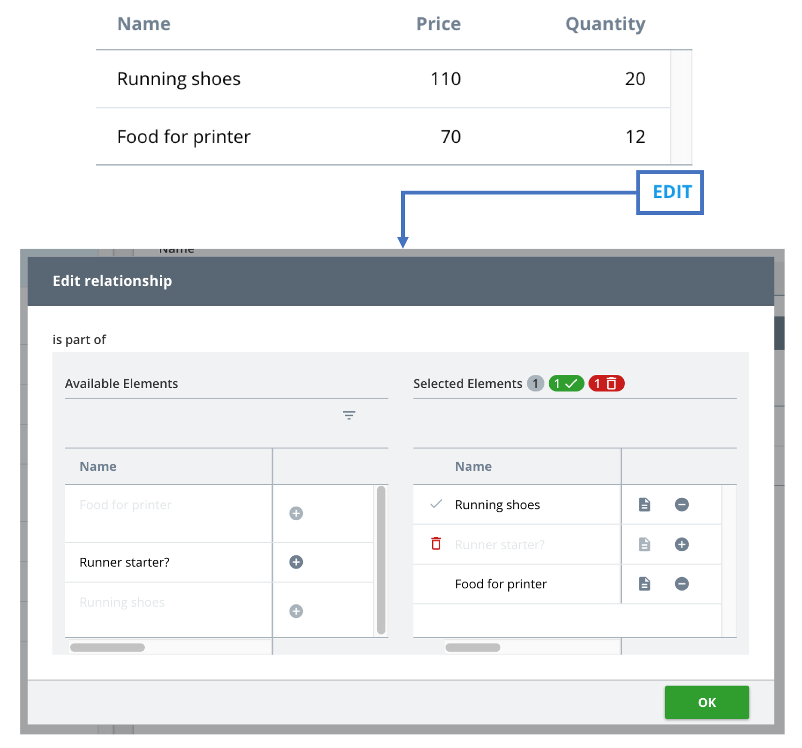
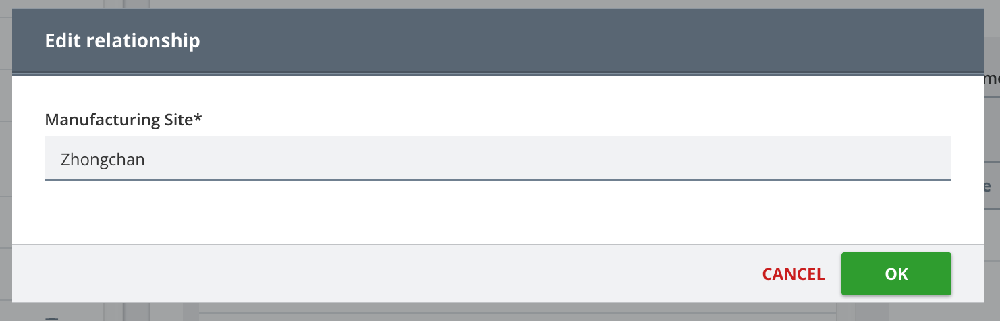
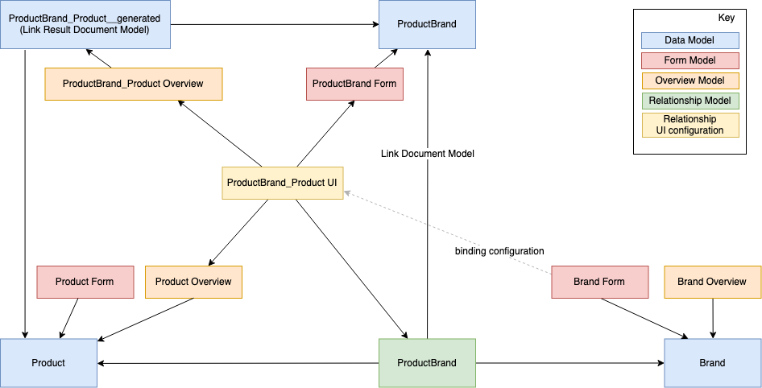

//// 
SPDX-License-Identifier: EUPL-1.2 OR LicenseRef-commercial
Copyright (c) 2012-2026 mgm technology partners GmbH
Dual License
This source file is part of the mgm A12 Platform and available under a choice of two different licenses:
1. Open-Source License - EUPL v1.2
You may redistribute and/or modify this file under the terms of the European Union Public License, version 1.2 - see https://eupl.eu/.
2. Commercial License
Alternatively, you may obtain a commercial license from mgm technology partners GmbH, that permits use of this software under different terms (including support and maintenance services).

Please contact a12-license@mgm-tp.com for more information.
    
You must select and comply with exactly one of the above license options.

Warranty Disclaimer (applies to either option)
THIS SOFTWARE IS PROVIDED "AS IS" AND WITHOUT WARRANTY OF ANY KIND, WHETHER EXPRESS OR IMPLIED, INCLUDING BUT NOT LIMITED TO THE WARRANTIES OF MERCHANTABILITY, FITNESS FOR A PARTICULAR PURPOSE AND NON-INFRINGEMENT, EXCEPT WHERE SUCH DISCLAIMERS ARE HELD TO BE LEGALLY INVALID. SEE THE RESPECTIVE LICENSE TEXT FOR DETAILS. 
////
== Relationship Engine

The Relationship Engine visualizes links and candidates of a relationship according to the configuration of the Relationship UI configuration.

=== Relationship UI Configuration

The Relationship UI configuration is the melting pot of all models and UI components used to display a relationship. A typical model looks like the following:

[source,json,options="nowrap"]
----
include::assets/typescript/ui-config-examples/ProductBrand-ui.json[]
----

It consists of..

* a unique name
* the name of the referenced Relationship model
* the side of the relationship which shall be displayed (called "target role")
* a list of component configurations used to visualize the relationship

Each component configuration contains..

* a unique component ID
* the ID of the View which shall be rendered (see <</relationships/view,Views>>)
* a list of models which are required to render the view
* additional properties which may be required by individual views

In general only the first component of the list is rendered by the engine, but individual views allow a reference to another component (see <</relationships/table-list,Table List>> as an example).

[#/relationships/view]
=== Views

A relationship can be displayed in several variants. Four views are provided by default, but projects can define their own UI.

Every default view requires an Overview Model for links and an Overview Model for candidates since the related documents are based on different result Document Models.

==== Drop Down Selection

A drop down selection allows the selection of a single link. Candidates are displayed in a drop down list, the selected link is shown in the input field.
By default, only the first 10 relevant candidates are shown, the remaining candidates will be displayed by clicking the "See More" button.

[NOTE]
====
* If no default sorting is specified, the candidate list is sorted by `__meta/createdAt` in descending order.
* Case is ignored during sorting (`ignoreCase` is set to true).
====

To provide a better modeling experience we have decided to reuse Overview Models for this component. The field value of the first overview column is used to display the link / candidate document.

Use `"name": "DropDownSelection"` in the UI configuration to present your relationship like this.
The view requires the following models:

[cols="1,1,10"]
|===
|modelType |use |Description

|"overview" |"link" |Overview Model to display link documents (the field value of the first overview column is used)
|"overview" |"candidate" |Overview Model to display candidate documents (the field value of the first overview column is used)
|"form" |"link" |Form Model describing the form used to modify the link document.

The form is shown when adding new links or by pressing the edit button. If no link Document Model is specified for the relationship, this Form Model is not required.
Please bind this view to a form control when using the Form Engine integration.
|===

==== Dual Pane Selection

With the dual pane selection users can manage multiple links for a document. All candidates are shown on the left, links are shown on the right side. Added links are highlighted green, removed links red. As soon as the changes are saved, the highlighting will be cleared.

The list of candidates can be filtered, sorted and paginated while the link table can only be paginated.
The sorting behavior for the candidate list is similar to the <<Drop Down Selection>>.
Furthermore, it's not possible to add custom row actions to the overview tables and the content box cannot be customized using the Overview Model.

Use `"name": "DualPaneSelection"` in the UI configuration to present your relationship like this.
The view requires the following models:

[cols="1,1,10"]
|===
|modelType: |use: |Description

|"overview" |"link" |Overview Model to display link documents
|"overview" |"candidate" |Overview Model to display candidate documents
|"form" |"link" |Form Model describing the form used to modify the link document.

The form is shown when adding new links or by pressing the edit button. If no link Document Model is specified for the relationship, this Form Model is not required.
Please bind this view to a form custom screen element when using the Form Engine integration.
|===

[#/relationships/table-list]
==== Table List

Some use cases may focus on a plain table listing the links without modifying them directly. The table list can be used for these scenarios.

Use `"name": "TableList"` in the UI configuration to present your relationship like this.
The view requires the following models:

[cols="1,1,10"]
|===
|modelType |use |Description

|"overview" |"link" |Overview Model to display link documents
|"overview" |"candidate" |Overview Model to display candidate documents
|===

For the table list an additional property "editComponent" can be specified in the "props" section of the component configuration. If another component configuration in the Relationship UI configuration exists with the ID given in the properties value, an edit button is displayed. When the button is clicked, the referenced edit component is displayed.

As an example, the following Relationship UI configuration …

[source,json,options="nowrap"]
----
include::assets/typescript/ui-config-examples/ProductBundle-table-list-ui.json[]
----

… will show a table list with edit button which will open a dual pane selection ..

Sorting and Filtering the listed links is not supported in the default table list.

Please bind this view to a form custom screen element when using the Form Engine integration.

[NOTE]
====
The relationship feature currently does not support multiple different usages of the same Relationship Model. For example you can not have multiple bindings for the same Relationship Model and use different Overview Models (with different settings). There is always only one configuration used for querying the candidates and the links respectively. This means that if you use two relationship components together (like shown above), they will always use the paging, sorting & filtering settings of the first component. If an optional setting is left empty in the first component, its default value will be used.
====

==== Custom UI (Experimental)

In addition to the default views mentioned above, projects can provide their own UI. To do so, they have to specify an own component provider as Relationship Engine property. The provider receives a component configuration and returns a React component providing one of the following interfaces:

* *ListProps* - Provides properties required to show links in a readonly list. Views should use this interface to provide a UI similar to the table list.
* *SingleSelectionProps* - Provides properties required to render a UI for the selection of a single link. Views should use this interface to provide a UI similar to the drop down selection.
* *MultiSelectionProps* - Provides properties required to render a UI for the selection of multiple links at the same time. Views should use this interface to provide a UI similar to dual pane selection.

We consider customization of the components to be an experimental feature at the moment.

[[relationship-localization]]
==== Custom Localization

All labels rendered by components of the relationship extension can be localized.

The extension comes with a localizer service, that can be created via a factory. It has to be configured among the application's localizer services to localize all multilingual texts defined in the Relationship Model and UI configuration.

If a particular label shall be localized independently of the model definition, the key can be overwritten by defining an own localizer service. The following keys are available:

* `relationship.ui-configuration.<name of the ui configuration>.<id of the custom component>.dual-pane.available-items.title` - Title of the candidate table in Dual Pane
* `relationship.ui-configuration.<name of the ui configuration>.<id of the custom component>.selected-items.title` - Title of the link table in Dual Pane
* `relationship.relationshipModel.<name of the relationship>.<name of the role>.labels` - The display label of a relationship role

The localization keys of static texts, which are not defined by models, are provided by the constant `RELATIONSHIP_RESOURCE_KEYS` which is located in `extensions/relationship`. This constant provides the keys as well as the documentation of their usage.

=== Link Form

A link between entities can have its own properties, e.g. the amount of a product in a bundle or the production site of a product for a brand.

Those properties need to be defined in a link Document Model and the respective UI requires a link Form Model.

If the link Form Model is provided in the Relationship UI configuration, then on creating a new link, a Form Engine will be shown in a modal, where the user can enter values for the link properties.

The shown Form Engine has some limitations, as it cannot be customized via properties and engine options.

=== Form Engine Integration

In most cases the Relationship Engine shall be integrated into a form. To do so, a custom Form Model map (RelationshipFormModelMap) has to be used by the Form Engine view.

If the map finds a custom screen element having a matching binding configuration of type "relationship", a relationship UI configuration is expected as configuration. This model is used to render the Relationship Engine. The CRUD Form Engine view supports this integration by default.

Please note that properties of the bound custom screen element / custom cell defined in the Form Model (e.g. a custom screen element title) are not considered by the Relationship Engine. If you intend to use the custom screen element title to structure your screen, please wrap the bound element with an additional section having the desired title.

[#/relationships/withoutCRUD]
==== Custom Form Engine

If you want to customize your Form Engine view (e.g. via the `FormModelMap`), you will have to integrate the Relationship Engine yourself as the CRUD extension does not support customization. You can achieve this by passing the `RelationshipFormModelMap` to the Form Engine component.

Take a look at the following code for an example:

[source,typescript,options="nowrap",title=Relationship Engine integration]
----
include::assets/typescript/integration.tsx[tag=content]
----

When adding your own customization to the `FormModelMap`, be sure to return the correct default component as shown in the following example:

[source,typescript,options="nowrap",title=Customized FormModelMap]
----
include::assets/typescript/customFormModelMap.tsx[tag=customFormModelMap]
----

=== Model Overview

When modeling relationships a lot of models are involved. This section should provide a short overview to put you back on track. As example we focus on the Relationship between products and brands. In a brand form assigned products shall be managed via a dual pane selection.

Before the introduction of the Relationship feature it was possible to define:

* A *Document Model* "Product" describing the properties of a product
* A *Form Model* "Product Form" showing a form to enter the product properties
* An *Overview Model* "Product Overview" showing products in a table

The same applies to brands.

It was not possible to model a connection between these entities.

From now on we can use a *Relationship Model* "ProductBrand" to define this connection. In our example the model specifies that multiple products are assigned to a brand and only one brand can be assigned to a product. If additional fields shall be defined for this Relationship, another Document Model "ProductBrand" can be referenced. It is called *"Link Document Model"* in this context.

The dual pane selection requires two Overview Models - one to define the candidate table (based on the "Product" Document Model) and one to define the link table. Link result documents are a combination of fields defined in the "Product" Document Model and fields defined in the *Link Document Model*. To reference this combination in the Overview Model another Document Model is required: The *Link Result Document Model*. It can be generated from the platform server.

If a *Link Document Model* is referenced in the *Relationship Model*, an additional Form Model is required for a form to modify the link document. It is called "ProductBrand Form" in the overview above.

The *Relationship UI configuration* references the view, the used overview / Form Models and the *Relationship Model* to show. To integrate the relationship directly in the form, the Relationship UI configuration is defined as a *binding configuration* in the "Brand Form" Form Model.

=== Fields projection

Fields projection are partially supported by the relationship bindings, including the loading of candidates and links table.
However, the link document fields shall not be projected and the binding will request a full document in all cases.
Customization of projected fields can be done via the Server Connector middlewares and should be done in a cautious approach to avoid removing the mandatory fields. 
Please consult Data Services documentation for more details.
